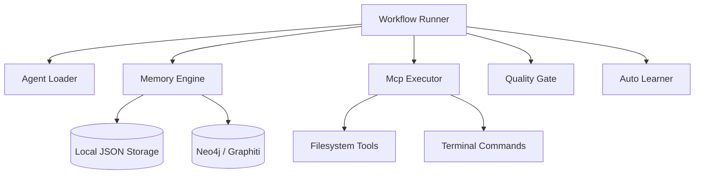

# Arquitectura de PsychoSv_503 AI DevOS

Este documento describe la arquitectura de PsychoSv_503 AI DevOS, un sistema operativo de desarrollo basado en agentes inteligentes multi-agente autónomos.

## 1. Vista General del Sistema

PsychoSv_503 AI DevOS es un framework diseñado para ejecutar workflows de desarrollo de software autónomos mediante un ciclo de razonamiento cerrado (Agent Loop). El núcleo coordina múltiples agentes especializados que se comunican, guardan memorias semánticas y ejecutan acciones reales en la máquina local usando herramientas del Protocolo de Contexto de Modelo (MCP).

## 2. Componentes Clave

### A. Workflow Runner (`runtime/workflow_runner.py`)
Coordina y ejecuta los pasos definidos en los archivos JSON de workflows (`workflows/`). Para cada paso:
1. Carga las instrucciones del agente.
2. Recupera memorias previas de la sesión.
3. Ejecuta el bucle del agente utilizando llamadas directas HTTP a APIs de LLMs (NVIDIA NIM o OpenAI).
4. Despacha herramientas solicitadas por el agente.

### B. MCPS Executor (`runtime/mcp_executor.py`)
Un entorno ejecutor de herramientas local autónomo que permite:
* Leer y escribir archivos locales dentro del límite seguro del workspace.
* Listar directorios del proyecto.
* Ejecutar comandos arbitrarios en la terminal con un límite de tiempo de 60 segundos.

### C. Memory Engine (`runtime/memory_engine.py`)
Maneja la persistencia de contexto semántico de dos formas:
1. **Local (Por defecto):** Archivos estructurados JSON organizados en `memory/sessions/`.
2. **Grafo Semántico (Opcional):** Integración con Neo4j a través de `GraphitiBridge` (`runtime/graphiti_bridge.py`) para extraer entidades e interacciones semánticas complejas en tiempo real.

### D. Auto Learner (`runtime/auto_learner.py`)
Un módulo de retroalimentación que analiza la ejecución del workflow (éxito/fallo, errores de calidad del Quality Gate) y extrae lecciones aprendidas para mejorar ejecuciones futuras.

### E. Quality Gate (`runtime/quality_gate.py`)
Validador estático de código que inspecciona la salida de los proyectos para verificar:
* Que no haya errores sintácticos en los archivos de Python generados (`ast.parse`).
* Que existan los archivos obligatorios exigidos para producción (`README.md`, `requirements.txt`).

---
*Actualizado por: Psycho-CEO | Fecha: 2026-06-15*
