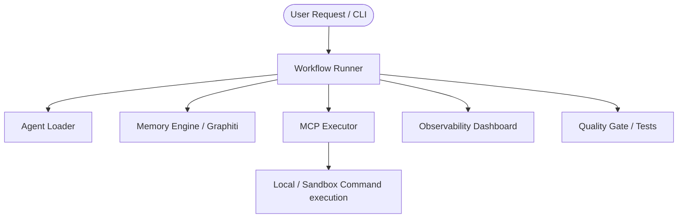

# Developer Guide — Psycho AI DevOS Architecture & Runtime Flow

Welcome to the Developer Guide. This document explains the internal mechanisms, architecture components, and execution flows of the **Psycho AI DevOS** agentic system.

---

## 1. System Architecture Overview

Psycho AI DevOS is a multi-agent framework designed to orchestrate software development tasks using autonomous AI agents equipped with Model Context Protocol (MCP) tools, RAG memory, and automated quality gating.

---

## 2. Core Components

### 2.1. Workflow Runner (`runtime/workflow_runner.py`)
The orchestrator that loads the workflow registry, instantiates step execution, and runs the agent loop. It coordinates failover between NVIDIA NIM models and OpenAI GPT models, manages token cost estimations, and ensures graceful shutdown by saving state to `memory/interrupted_state.json` on `SIGINT`/`SIGTERM`.

### 2.2. Agent Loader (`runtime/agent_loader.py`)
Loads instructions, credentials, and identity definitions from individual `agents/` directories.

### 2.3. Memory Engine (`runtime/memory_engine.py` & `runtime/graphiti_bridge.py`)
Provides semantic recall and pattern storage.
- If Neo4j credentials and Graphiti API keys are present, it uses `Graphiti` to build dynamic episodic graph networks of lessons learned.
- If Graphiti is disabled, it transparently falls back to local JSON-based structured pattern storage.

### 2.4. MCP Executor (`runtime/mcp_executor.py`)
Executes tools (such as reading/writing files, listing directories, and running commands). Enforces strict path validation (`_resolve_path`) within the workspace boundary and performs role-based command whitelist checks to prevent unauthorized scripts from executing.

### 2.5. Quality Gate (`runtime/quality_gate.py`)
Runs automated checks (syntactic verification, bandit security checks, unit testing) on generated projects before marking workflows as successful.

### 2.6. Observability Dashboard (`runtime/dashboard.py`)
Runs a background multi-threaded HTTP server (default port `8050`). It collects real-time metrics, processes `ask_user` prompts dynamically from the Web UI, exposes workflow progress nodes, and outputs formatted color-coded agent logs.

---

## 3. The Runtime Loop Step-by-Step

When a workflow runs:
1. **Initialize State**: The `WorkflowRunner` spins up the background `Dashboard` server.
2. **Execute Steps**: For each agent step in the workflow definition:
   - Load agent context and system prompts.
   - Run the agent loop: query the LLM with context compressed dynamically by `ContextCompressor`.
   - Parse tool calls. If the agent makes a tool call, the `McpExecutor` validates its safety (role-based command checks and folder confinement).
   - If the tool is `ask_user`, execution halts, setting a `pending_question` on the dashboard, and waits until a response is typed in the CLI or submitted via the web interface.
   - Save the outcome of the step in the `MemoryEngine`.
3. **Quality Gating**: Once steps finish, the `QualityGate` evaluates the project workspace.
4. **Auto-Learning**: The `AutoLearner` parses execution details and logs, updating the global `lessons_learned.md` registry with tips for future workflows.
