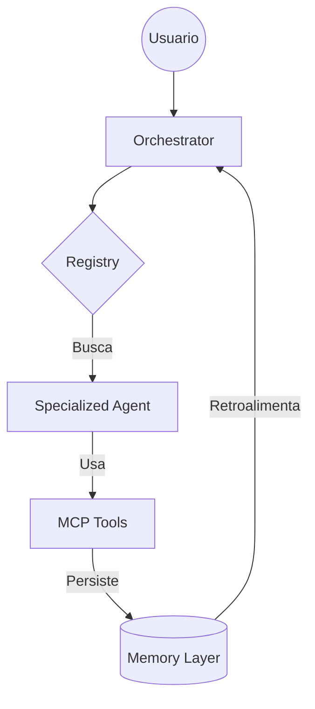

# VISTA GENERAL DE LA ARQUITECTURA (AI DevOS ARCHITECTURE)

## 1. EL MODELO DE CAPAS
El AI DevOS está diseñado de forma modular para permitir la escalabilidad y la independencia de componentes.

### Capa 1: Gobernanza (Standards)
Contiene la **Constitución**, los protocolos de comunicación y las reglas de seguridad. Es la ley que rige el comportamiento de todos los agentes.

### Capa 2: Orquestación (Orchestrator)
El cerebro central que recibe las solicitudes del usuario, consulta el `registry` para saber qué agentes y herramientas tiene disponibles, y coordina la ejecución.

### Capa 3: Agentes Especialistas (Agents)
Expertos en áreas específicas (Backend, UI, Security, etc.) que ejecutan tareas bajo la supervisión del Orquestador.

### Capa 4: Herramientas y Conectividad (MCPs)
El puente hacia el mundo real. Provee acceso a archivos, terminales, bases de datos y servicios externos.

### Capa 5: Persistencia y Conocimiento (Memory)
La base de datos de lecciones aprendidas, decisiones arquitectónicas e historial de proyectos.

## 2. FLUJO DE TRABAJO ESTÁNDAR

## 3. ESCALABILIDAD
Gracias al sistema de `registry`, añadir una nueva capacidad al sistema consiste simplemente en:
1. Crear el nuevo MCP o definición de Agente.
2. Registrarlo en el JSON correspondiente en `/registry`.
3. Inmediatamente, el Orquestador podrá utilizarlo sin necesidad de recompilar el sistema central.

---
*Este documento es la referencia técnica para el AI Engineer y el Solution Architect.*
