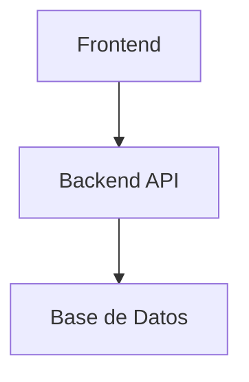

# Arquitectura del Sistema — [Nombre del Proyecto]

## 1. Vista General
> Describe brevemente la arquitectura del sistema.

## 2. Diagrama de Componentes

## 3. Flujos de Datos Principales
> Describe las rutas críticas de datos (ej. Auth, CRUD, etc.)

## 4. Decisiones Arquitectónicas
> Registra las decisiones de diseño importantes y sus justificaciones.

---
*Actualizado por: [Agente] | Fecha: [YYYY-MM-DD]*
